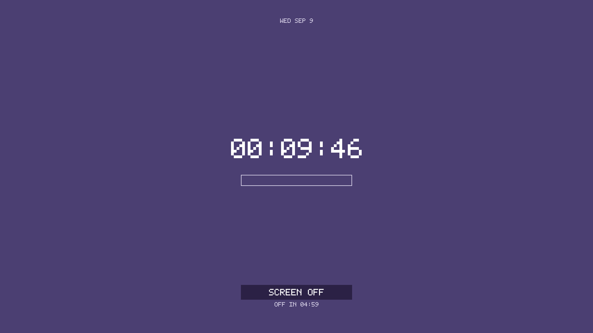

# waylock-rs

A deliberately small screen locker for Wayland compositors implementing
`ext-session-lock-v1`.



The first scope is intentionally narrow:

- solid-color shared-memory background;
- a built-in bitmap clock;
- a built-in screen-off countdown and optional power-off command;
- a clickable `SCREEN OFF` button when a power-off command is configured;
- PAM authentication through the `swaylock` PAM service;
- no image loading, GPU renderer, GTK, Cairo, Pango, animations, or effects.

The built-in defaults are `#4B3F72` and a 600-second screen-off countdown;
these can be overridden in the config file.

## Build

```sh
cargo build --release
```

## Code layout

- `config.rs` loads defaults, the config file, and command-line overrides.
- `auth.rs` contains the PAM authentication boundary.
- `render.rs` contains the SHM renderer, bitmap font, and lock-surface layout.
- `main.rs` owns the Wayland session-lock lifecycle and input/event handling.

## Usage

```sh
waylock-rs
```

The default configuration file is `~/.config/waylock-rs/config`; use
`--config PATH` to select another file. Command-line options override file
values. See [`config.example`](config.example) for the supported keys:

```ini
color = 4B3F72
off-after = 300
power-off-command = niri msg action power-off-monitors
pam-service = swaylock
```

The protocol is compositor-neutral, but a compositor must implement
`ext-session-lock-v1`; Wayland itself does not require every compositor to
provide it. The client must be started inside the graphical session so it
inherits `WAYLAND_DISPLAY`.

The countdown is visual by default. To power off displays when it reaches zero,
provide a compositor-specific command in the config file. For Niri:

```ini
power-off-command = niri msg action power-off-monitors
```

Other compositors can use their own display-power command, or leave this to an
idle daemon such as `swayidle`.

When the command is configured, the same action is available from the visible
`SCREEN OFF` button on the lock surface.

This is an early implementation. It should be tested manually with the real
session before replacing a known-good locker in an idle command.
